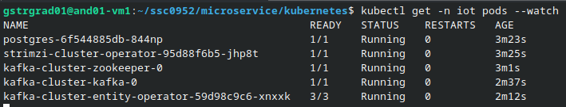

# Microsserviços

Lembre-se de abrir a pasta atual:

```shell
cd ./microservice # A partir da raiz do repositório
```

Copie para o contexto atual os arquivos necessários:

```shell
rm -rf .env proto
cp ../proto proto -r
cp ../config.env .env
```

## Instalação do K3s

Vamos instalar uma distribuição simplificada do Kubernetes, chamada de K3s. Assumimos aqui uma configuração em que haverá um único node (uma única máquina), que conterá todos os pods relativos aos microsserviços. Também assumiremos que, no firewall dessa máquina, foram liberadas as portas `$HTTP_PORT` e `$WS_PORT`, conforme definido no `config.env`.

Por padrão, o intervalo de portas (do host) disponíveis ao Kubernetes é `30000-32767`. Por limitações das portas liberadas pelo docente para uso na disciplina (`7011` e `7111`), esse intervalo precisou ser alterado. Durante a instalação, certifique-se de definir o `$PORT_RANGE` de modo que `$HTTP_PORT` e `$WS_PORT` estejam nele contidas.

Abaixo, faremos o download do script de instalação:

```shell
wget https://get.k3s.io -O k3s_install.
```

Caso as portas liberadas estejam fora do intervalo padrão, executar conforme abaixo, modificando o intervalo se necessário:

```shell
PORT_RANGE="7000-7200"
INSTALL_K3S_EXEC="server --service-node-port-range $PORT_RANGE" sh ./k3s_install.sh
```

Caso contrário, simplesmente executar o script baixado:

```shell
sh ./k3s_install.sh
```

Terminada a instalação, sobrescrevemos o arquivo em `KUBECONFIG` para permitir o correto funcionamento do `kubectl`:

```shell
echo "export KUBECONFIG=\$HOME/.kube/config" >> ~/.bashrc
source ~/.bashrc

mkdir $(dirname $KUBECONFIG) -p
sudo k3s kubectl config view --raw > "$KUBECONFIG"
chmod 600 "$KUBECONFIG"
```

## Implantação do Postgres e do Kafka

Infelizmente, diferentemente do Docker Compose, o Kubernetes não permite, de forma fácil, o uso de variáveis de ambientes para modificar os próprios arquivos de manifesto (`*.yaml`). Como desejamos customizar algumas coisas, como as portas, os IPs, a própria imagem de Docker etc, faremos um workaround: na pasta `kubernetes/templates/`, encontram-se os manifestos "puros", com as variáveis de ambientes não configuradas (por exemplo, há linhas como: `image: $MICROSERVICE_IMAGE`). Utilizando a ferramenta `envsubst` (nativa do Linux), iremos fazer a substituição dos nomes das variáveis pelos seus valores conforme definido no `config.env`.

Para isso, execute o script:

```shell
sh ./scripts/replace_kubernetes_variables.sh
```

Agora, os arquivos de configuração prontos se encontram na pasta `kubernetes/replaced`. Portanto, devemos entrar na pasta:

```shell
cd ./kubernetes/replaced
```

> **Atenção:** Caso alguma variável seja alterada, deve-se executar novamente o `replace_kubernetes_variables.sh`.

Feito isso, podemos aplicar os arquivos:

```shell
# Cria um namespace para a aplicação
kubectl create namespace iot

# Criando um ConfigMap baseado nas configurações da aplicação
kubectl apply -n iot -f ./0_app_config.yaml

# Instalando o Kafka (e criando seus tópicos) e o Postgres
kubectl apply -n iot -f ./1_strimzi_install.yaml \
                     -f ./2_kafka_persistent_single.yaml \
                     -f ./3_topics.yaml \
                     -f ./4_postgres.yaml
```

Antes de continuar, use o comando abaixo e certifique-se que há ao menos um pod READY de cada um dos tipos: `kafka-cluster-kafka`, `kafka-cluster-zookeeper` e `postgres`. **Aviso:** isso pode demorar.

```shell
kubectl get -n iot pods --watch
```

Abaixo segue um exemplo dos containers em estado READY:



## Implantação dos Microsserviços

Por fim, vamos inicializar os microsserviços:

```shell
kubectl apply -n iot -f ./5_microservice_deployments.yaml \
                     -f ./6_microservice_services.yaml
```

Pode-se, então, aguardar para que todos os pods novos estejam READY.

```shell
kubectl get -n iot pods --watch
```